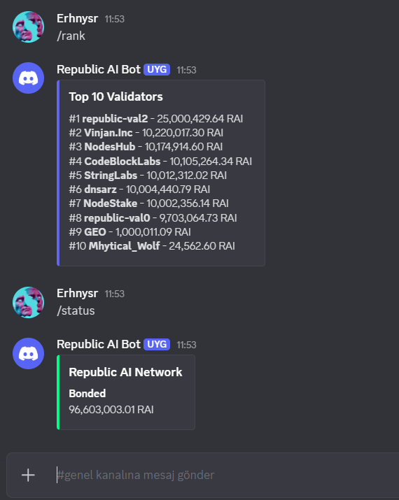

# Republic AI Discord Bot

A Discord bot for monitoring Republic AI testnet validators and compute jobs.

## Preview

## Features
- `/validator <name>` - Get validator info
- `/rank` - Top validators leaderboard  
- `/status` - Network status
- `/jobs` - Recent compute jobs
- Auto jail/unjail alerts every 5 minutes

## Setup
1. Install dependencies: `pip install -r requirements.txt`
2. Set `BOT_TOKEN` and `ALERT_CHANNEL_ID` in `republic_bot.py`
3. Run: `python3 republic_bot.py`

## Requirements
- Python 3.8+
- discord.py 2.3.2
- aiohttp 3.9.1
